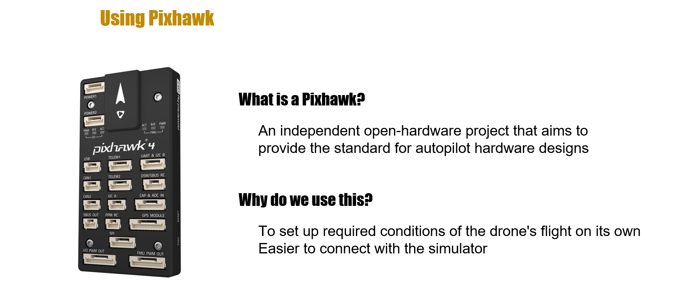
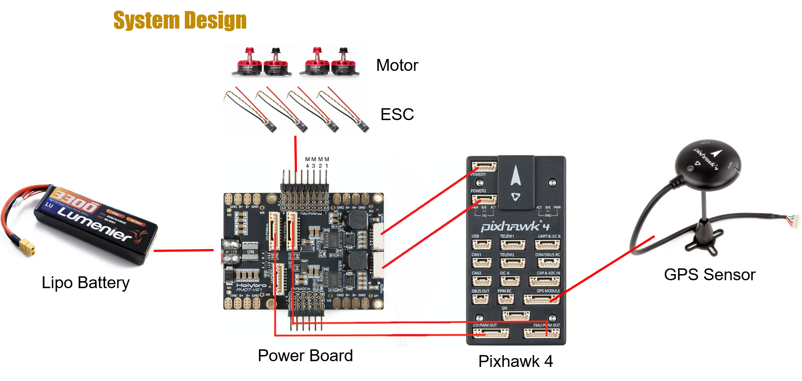
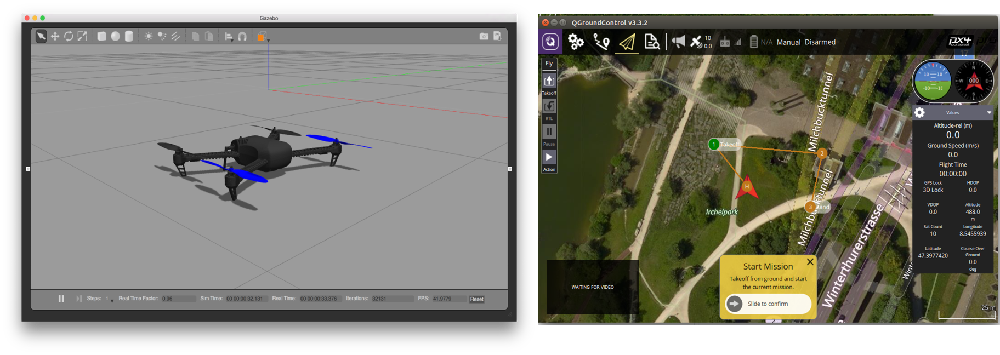
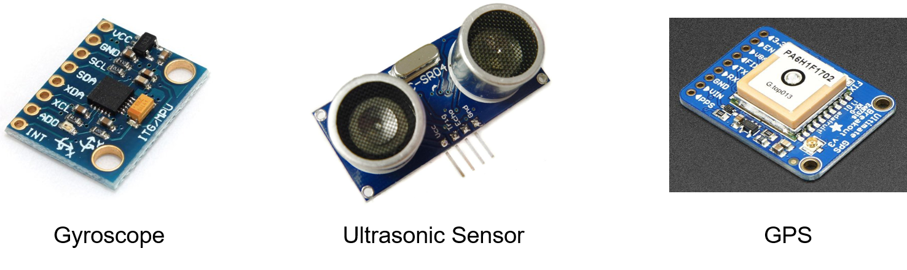
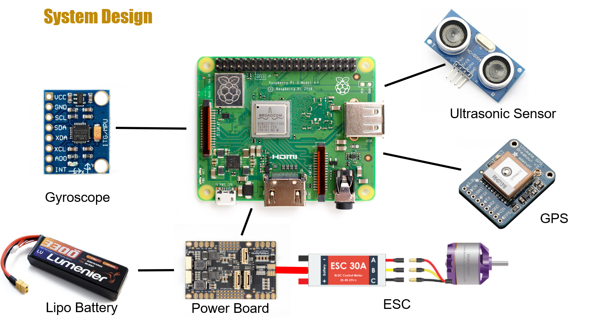
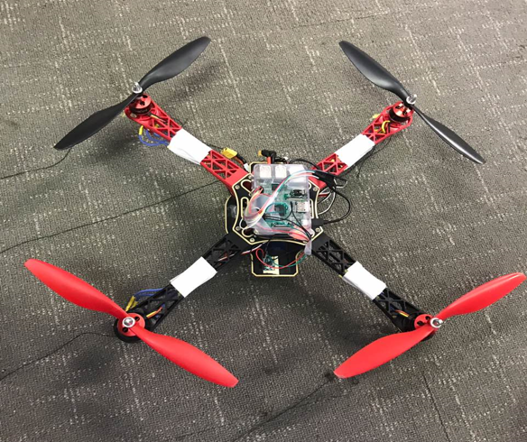
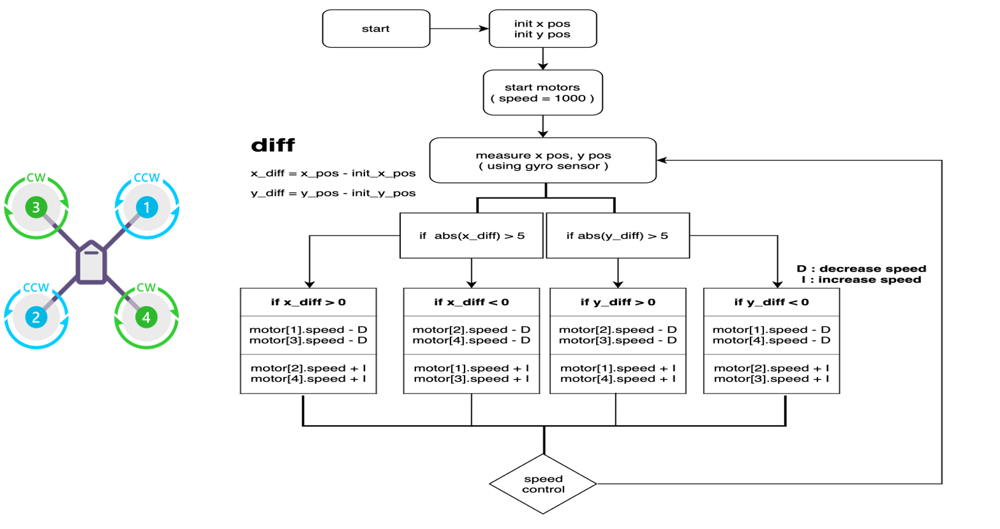
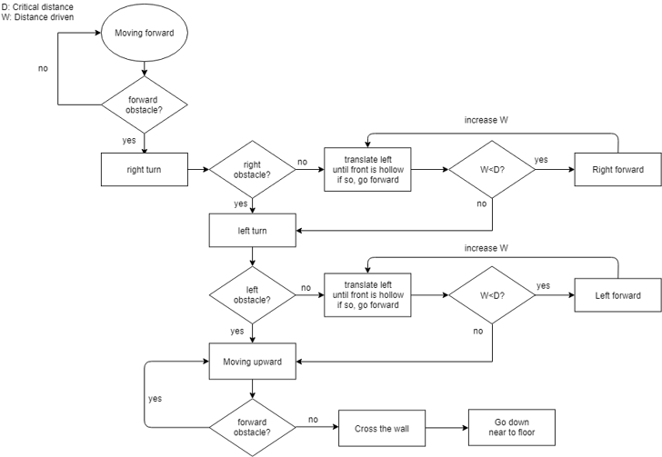
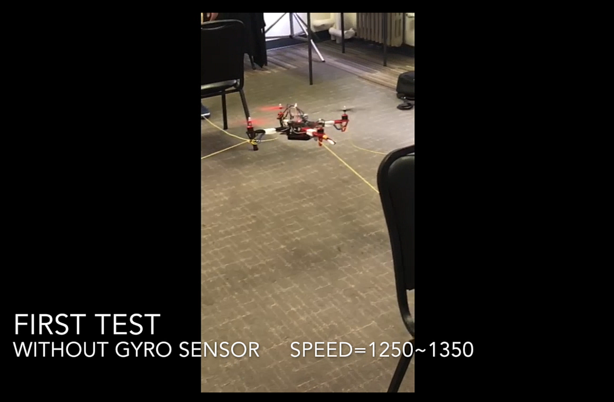
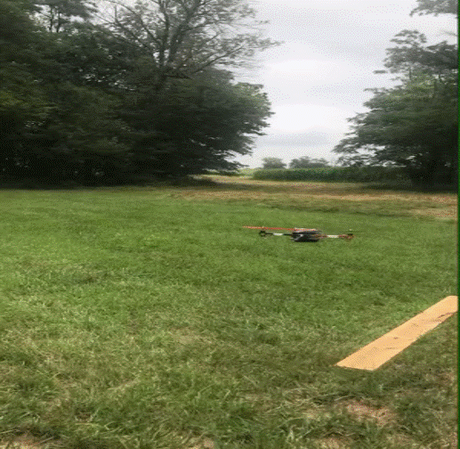

# Stealth drone project
## K-SW summer program

### Approach
- Build a completely autonomous drone requiring NO RF transmission or receipt to be able to
  fly autonomously on a pre-programmed course. Be invisible and invulnerable to RF based
  CUAS systems. This is a challenge project for development of red team/blue team counter
  UAV development.
- solve the Stealth problem related to Vision by Algorithm
- try yo make drone which flights autonomousley(without manual control)


### Process
  1. Learn how to fly a drone by manipulating it
  2. Make a drone
  3. Learn about Pixhawk and setting up required environment
  4. Learn “How to move drone with radio frequency by receiver and transmitter”
  5. Test with pixhawk and simulator then drive the drone
  6. Set up a Raspberry pi for drone&#39;s flight
  7. Try to make drone which flights autonomously (without manual control)
  
    7-1. Make drone floats
    7-2. Make drone move
    7-3. Equip Sensors and check connection
    7-4. Apply driving algorithms
  8. Test driving for finding optimize algorithm
  9. Apply stealth algorithms
### Using Pixhawk
<p>
  
</p>

#### Envirionment, Modules & Related Softwares
<p>
  
</p>

#### System design
<p>
  
</p>

#### Simulation 
<p>
  
</p>

### Using Only Raspberry Pi

#### Sensors
<p>
  
</p>

#### System design
<p>
  
</p>

#### Completed drone
<p align="center">
  
</p>

#### Gyro algorithm
<p>
  
</p>

#### Ultrasonic algorithm
<p>
  
</p>

#### Test Flight 
<p>
  
</p>

```
- D : Increase degree of motor speed
- E : Decrease degree of motor speed
- S : Interval time for change speed (length of time sleep())
```

## Result
<p align="center">
  
</p>
